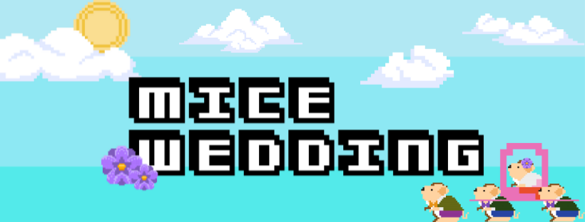
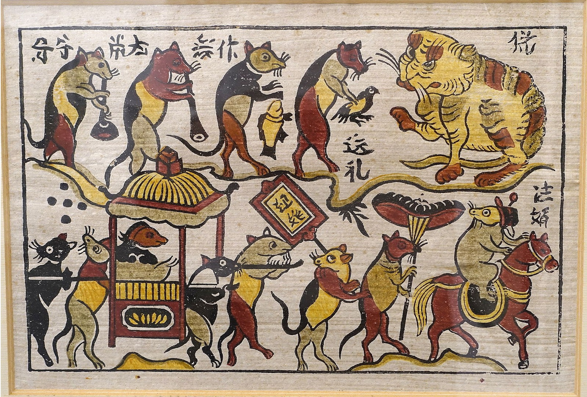

# Mice Wedding Game

# Run game

How to run the game on Swift Playgrounds:

1. Download and install [Swift Playgrounds](https://apps.apple.com/ca/app/swift-playgrounds/id908519492) from App Store on MacOS
2. Download Playground-MiceWedding.swiftpm in this repository
3. Run Playground-MiceWedding.swiftpm on Swift Playgrounds
4. Let's play and enjoys!

# Inspiration

Growing up in Sai Gon, I developed a strong connection to the people, culture, and natural beauty of my hometown. I was particularly fascinated by [Dong Ho paintings](https://en.wikipedia.org/wiki/%C4%90%C3%B4ng_H%E1%BB%93_painting), which have a rich history in Vietnam dating back to the 17th century. The charming illustrations and humorous storyline of a tale about two rats in love who must overcome obstacles to be married inspired me to create "Mice Wedding". Through this game, I aim to share this story with others in a fun and interactive way while also introducing them to Vietnamese culture.

Image credit: [Wikimedia](https://commons.wikimedia.org/wiki/File:Mice%27s_wedding,_Dong_Ho_picture,_paper_-_Vietnam_National_Museum_of_Fine_Arts_-_Hanoi,_Vietnam_-_DSC05290.JPG)

# Gameplay & Technologies

"Mice Wedding" is a 2D game featuring two levels of gameplay, where players control a group of mice using touch and swipe gestures to collect leaves and avoid the cat. The game offers unique challenges and obstacles in each level to keep players engaged.

* SpriteKit, a 2D game engine, was utilized to create smooth and responsive animations for the game's characters and objects.
* SKPhysicsContactDelegate protocol was used to manage the game's physics and collision detection, ensuring accurate and reliable collision detection between objects.
* SKActions were employed to create natural-looking movements and animations, while data structures like ArrayList and loops were used to manage different node categories and set properties.

# Demo

# Credits

* Image assets are freely available under the Creative Commons license and were sourced from platforms like [Freepik](https://www.freepik.com/) and [Vecteezy](https://www.vecteezy.com/).
* Sounds have been licensed from the [Uppbeat](https://uppbeat.io/) platform under the Creative Commons Attribution-ShareAlike 4.0 International (CC BY-SA 4.0) license.
